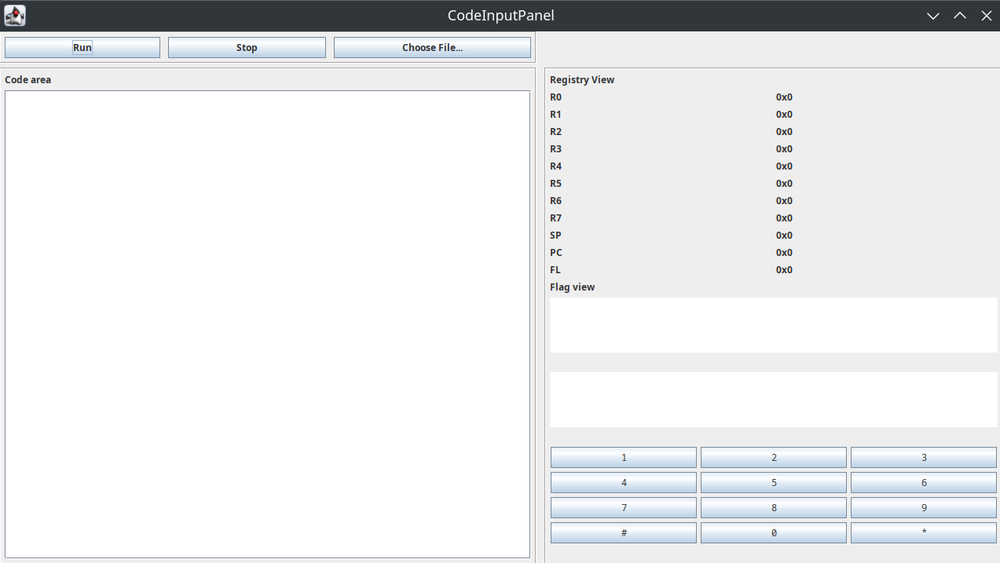

## User Manual

### System Requirements

- [JDK 21](https://openjdk.org/projects/jdk/21/) or higher
  - [Installation instructions of prebuilt OpenJDK packages](https://openjdk.org/install/)
- [Apache Maven](https://maven.apache.org/download.cgi)

### Building the Project

The following steps can be done in the CLI or in an IDE.

Run the `package` target to pull all dependencies and package the target.

```shell
mvn package
```

This will output a built archive: `./target/compu-sim-x.y-SNAPSHOT.jar`.

### Running all tests

To run all tests, invoke the maven `test` target.

```shell
mvn test
```

### Running specific targets

With a build archive snapshot, invoke the java runtime for the application entry-points:

- [Main user interface](#main-user-interface) - ro.uaic.swqual.swing.CodeInputPanel
```shell
java -cp target/compu-sim-x.y-SNAPSHOT.jar ro.uaic.swqual.swing.CodeInputPanel
```

- [Tester interface](#tester-interface) - ro.uaic.swqual.tester.Tester
```shell
java -cp ./target/compu-sim-x.y-SNAPSHOT.jar ro.uaic.swqual.tester.Tester /path/to/checked/asm/file
```

#### Main User Interface

Opening the main user interface program will launch the following user interface:



Code View, left area:

- To load an assembly program, use `Choose File...`.
- To run the program without supervision, use `Run`.
- To break or step, use `Stop`.

Registry View, right area:

- Shows the 8 Data Register values (`r0`...`r7`)
- Shows the Stack Pointer register value (`sp`)
- Shows the Program Counter register value (`pc`)
- Shows the Flags register value (`fl`)

Peripheral area, lower-right:

- A keypad to interact with the CPU. The inputs can be accessed by reading address `0x10`.
  - ```mov r3 [0x10];```
  - Will be 0 when no value was input. Otherwise, will be the ASCII value of the pressed key. 
- A textbox above the keypad displaying the "Display" output. This can be accessed by writing from `[0x20]` to `[0x50]`.
  - Each address past `[0x20]` represents a character
  - ```mov [0x20] 97; mov [0x21] 98; mov [0x22] 99;``` will display 'abc'

#### Tester Interface

As part of the unit testing strategy, a source-aware simulator framework was created.

The tester target can run files under `resources/checks` and can evaluate the state
of the CPU emulator by request. The evaluation requests are done in comments in source files.

To run a check (example: `checks/alu/mem_operations.asm`):
```sh 
java -cp ./target/compu-sim-x.y-SNAPSHOT.jar ro.uaic.swqual.tester.Tester alu/mem_operations.asm 
```

##### Tester Syntax

To have a file be validated by the tester, a header is required:

```asm
// sim-test
// expected: success

... code
```

Evaluation requests can be done by adding them to the end of an instruction line.
These will be evaluated post line execution.

The tester also contains an emulated keyboard and display, which will be detailed below.
Their addresses are:
- keyboard - `[0x10]`
- display - `[0x20]` - `[0x50]`

Evaluation requests are either expectations of true/false:
`// expect-true {...}` or `// expect-false {...}` either display expectations (emulating the display component)
`// expect-display {...}`

Expectations of true/false can contain any number of comparisons of the same types of values used in the code.
Multiple comparisons are separated by `;`.

Display expectations must contain the expected displayed text. 
Keep in mind that the text must be null-terminated.

Examples of expectations:
```asm
mov r0 5; // expect-true {r0 == 5}
mov r1 10; // expect-false {r1 == 15}
add r1 r0; // expect-true {r0 == 5; r1 == 15}

mov [0x20] 97;
mov [0x21] 98;
mov [0x22] 99;
mov [0x23] 0; // expect-display {abc}
```

The keyboard peripheral can be interacted by using `// kb-preload {values, ...}`.
These must be standalone, not attached to instructions, as these are not expectations.

Example of keyboard loading:

```asm
// kb-preload {0x60, 0x61, 0x62}

mov r0 [0x10]; // expect-true {r0==0x60}
mov r0 [0x10]; // expect-true {r0==0x61}
mov r0 [0x10]; // expect-true {r0==0x62}
mov r0 [0x10]; // expect-true {r0==0x00}
```
